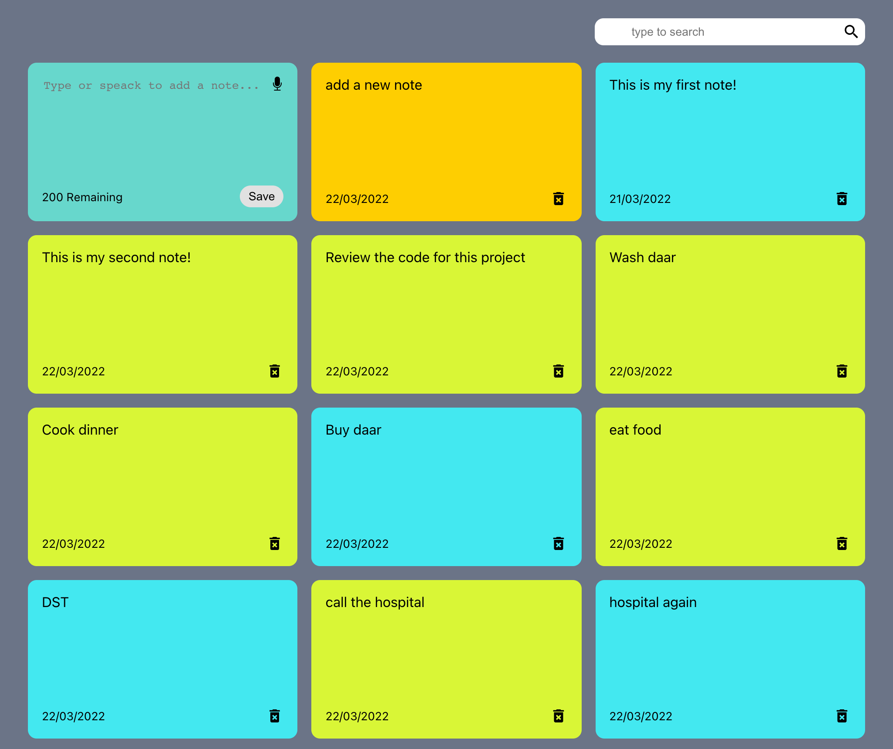

# Sticky Notes

A sticky note application built with react.js and css

## Description

I want to create an app that i could use in my day to day live and i created this note taking app. 
it is similar to sticky notes in design and it stores the notes, 
so users can refresh the page and the notes would still be there.
I also wanted to give users the ability to use speach recognition instead of typing it out. 

After using it for some time i wanted to add a feature that would let me edit a note.

## Features
- Search for a note
- Delete a note
- Stores note in local storage
- Record a note using speech recognition API
- Edit A note
- Fully Responsive

## Links

Live site => [On netlify](https://sticky-notes-react-app.netlify.app/)

## Built with

- React.js
- Css Grid

## Screenshots

